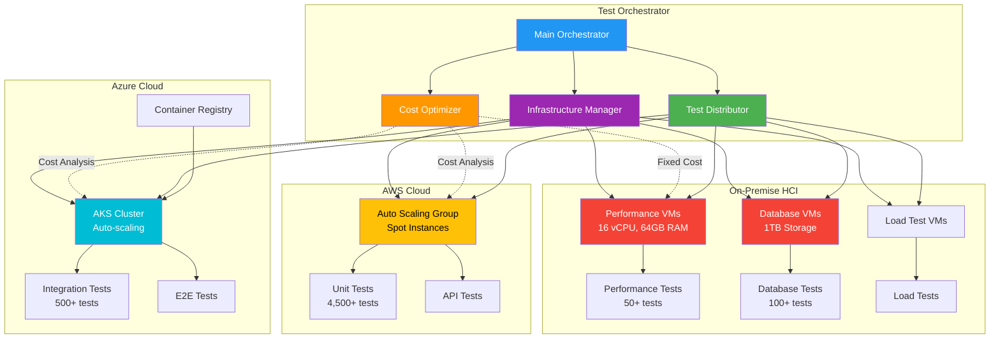
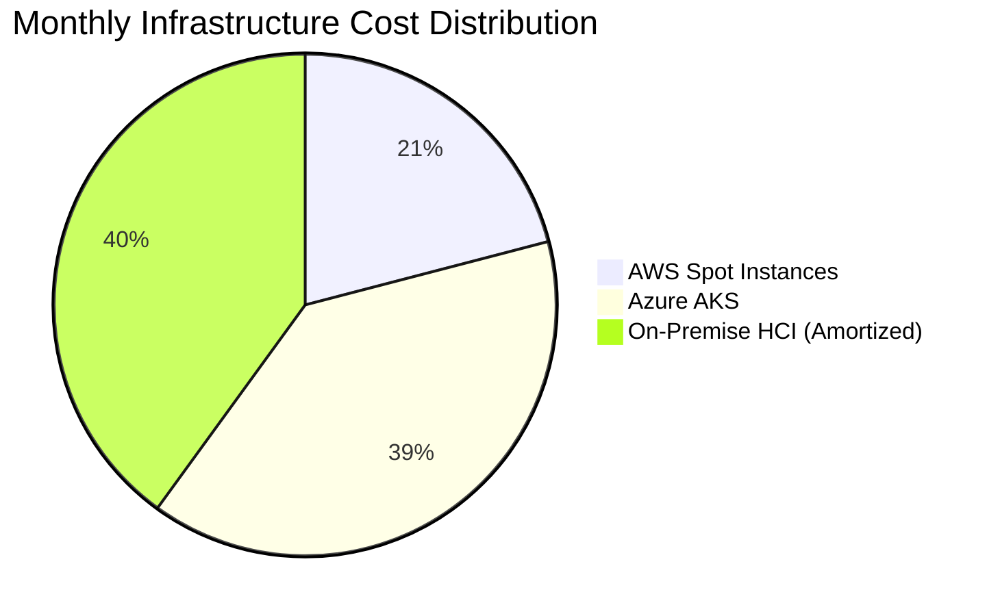
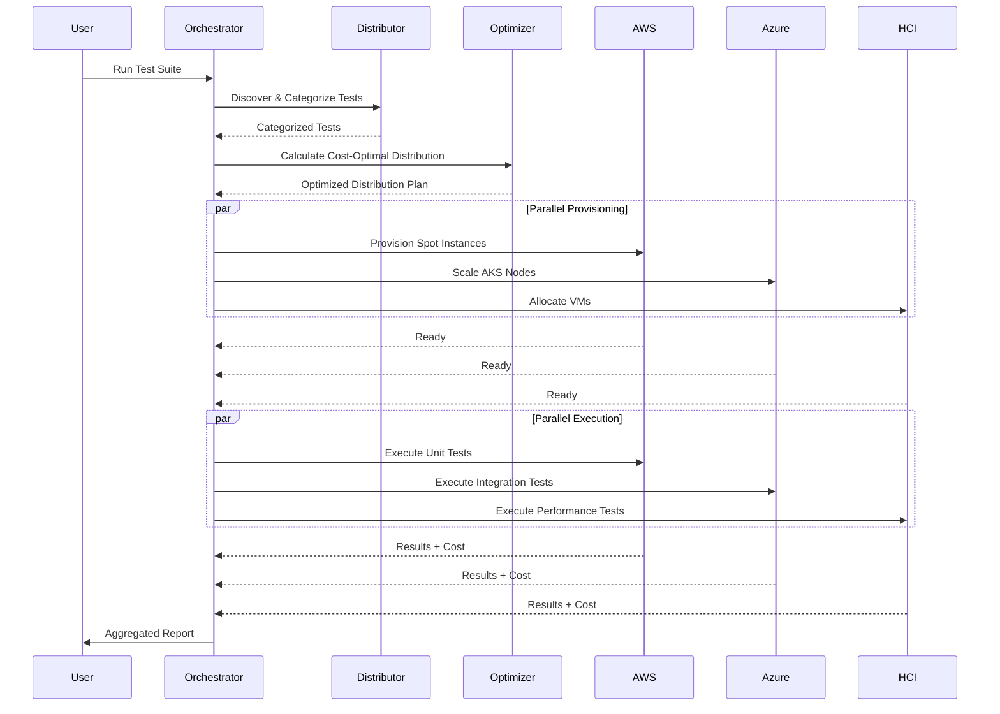
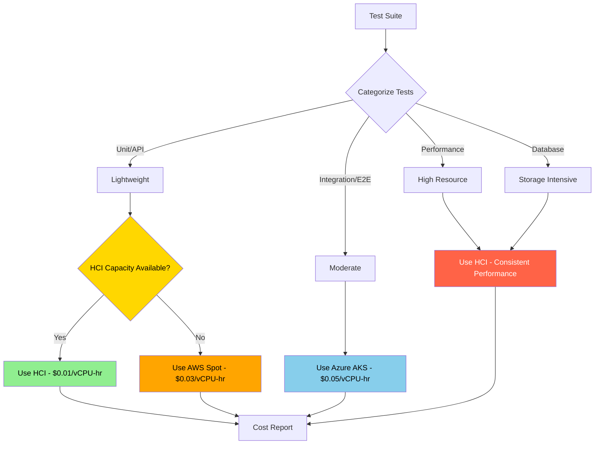

# Architecture Diagram

```mermaid
graph TB
    subgraph "Test Orchestrator"
        A[Main Orchestrator] --> B[Test Distributor]
        A --> C[Cost Optimizer]
        A --> D[Infrastructure Manager]
    end
    
    subgraph "AWS Cloud"
        E[Auto Scaling Group<br/>Spot Instances] --> F[Unit Tests<br/>4,500+ tests]
        E --> G[API Tests]
    end
    
    subgraph "Azure Cloud"
        H[AKS Cluster<br/>Auto-scaling] --> I[Integration Tests<br/>500+ tests]
        H --> J[E2E Tests]
        K[Container Registry] --> H
    end
    
    subgraph "On-Premise HCI"
        L[Performance VMs<br/>16 vCPU, 64GB RAM] --> M[Performance Tests<br/>50+ tests]
        N[Database VMs<br/>1TB Storage] --> O[Database Tests<br/>100+ tests]
        P[Load Test VMs] --> Q[Load Tests]
    end
    
    B --> E
    B --> H
    B --> L
    B --> N
    B --> P
    
    C -.Cost Analysis.-> E
    C -.Cost Analysis.-> H
    C -.Fixed Cost.-> L
    
    D --> E
    D --> H
    D --> L
    D --> N
    D --> P
    
    style A fill:#2196F3,color:#fff
    style B fill:#4CAF50,color:#fff
    style C fill:#FF9800,color:#fff
    style D fill:#9C27B0,color:#fff
    style E fill:#FFC107,color:#000
    style H fill:#00BCD4,color:#fff
    style L fill:#F44336,color:#fff
    style N fill:#F44336,color:#fff
```

## Infrastructure Costs

```mermaid
pie title Monthly Infrastructure Cost Distribution
    "AWS Spot Instances" : 670
    "Azure AKS" : 1250
    "On-Premise HCI (Amortized)" : 1280
```

## Test Execution Flow

```mermaid
sequenceDiagram
    participant User
    participant Orchestrator
    participant Distributor
    participant Optimizer
    participant AWS
    participant Azure
    participant HCI
    
    User->>Orchestrator: Run Test Suite
    Orchestrator->>Distributor: Discover & Categorize Tests
    Distributor-->>Orchestrator: Categorized Tests
    
    Orchestrator->>Optimizer: Calculate Cost-Optimal Distribution
    Optimizer-->>Orchestrator: Optimized Distribution Plan
    
    par Parallel Provisioning
        Orchestrator->>AWS: Provision Spot Instances
        Orchestrator->>Azure: Scale AKS Nodes
        Orchestrator->>HCI: Allocate VMs
    end
    
    AWS-->>Orchestrator: Ready
    Azure-->>Orchestrator: Ready
    HCI-->>Orchestrator: Ready
    
    par Parallel Execution
        Orchestrator->>AWS: Execute Unit Tests
        Orchestrator->>Azure: Execute Integration Tests
        Orchestrator->>HCI: Execute Performance Tests
    end
    
    AWS-->>Orchestrator: Results + Cost
    Azure-->>Orchestrator: Results + Cost
    HCI-->>Orchestrator: Results + Cost
    
    Orchestrator->>User: Aggregated Report
```

## Cost Optimization Strategy

```mermaid
flowchart TD
    A[Test Suite] --> B{Categorize Tests}
    B -->|Unit/API| C[Lightweight]
    B -->|Integration/E2E| D[Moderate]
    B -->|Performance| E[High Resource]
    B -->|Database| F[Storage Intensive]
    
    C --> G{HCI Capacity Available?}
    G -->|Yes| H[Use HCI - $0.01/vCPU-hr]
    G -->|No| I[Use AWS Spot - $0.03/vCPU-hr]
    
    D --> J[Use Azure AKS - $0.05/vCPU-hr]
    
    E --> K[Use HCI - Consistent Performance]
    F --> K
    
    H --> L[Cost Report]
    I --> L
    J --> L
    K --> L
    
    style G fill:#FFD700,color:#000
    style H fill:#90EE90,color:#000
    style I fill:#FFA500,color:#000
    style J fill:#87CEEB,color:#000
    style K fill:#FF6347,color:#fff
```
